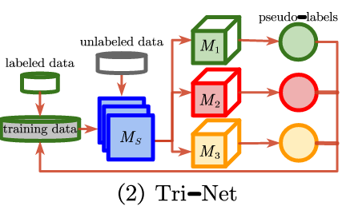

# deep semi-supervised learning survey
## Pseudo-labeling method
### Disagreement-based models
1. Tri-Net:
(1)one shared module to generate feature then followed three modules to generate prediction. If two modules are generating same pesudo labels of unlabelled data, this sample will be added to the training set of the third module.   
(2)In the whole procedure, the unlabelled sample can be pseudo-labeled by this formula:  
$argmax_{K}{p(M_{1}(M_{S}(X)))+p(M_{2}(M_{S}(X)))+p(M_{3}(M_{S}(X)))}$  
  

