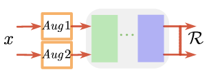

# deep semi-supervised learning survey
## Assuptions
## Generative methods
## Graph-based methods
## Consistency regularization
1. Assumption that realistic perturbations of the data points should not change the output of the model.  
2. The common structure of consistency regularization SSL methods is the teacher-student structure.As a teacher, the model learns as before, and as a teacher, the model generates target simultaneously  
3. $f(\theta)$ means the prediction from model for input x, while $T_{x}$ is the consistency target of the teacher. So the consistency constraint is defined as below:  
$ER(f(\theta,x),T_{x})$  
4. These method vary in how they generate the target  

### Ladder Network
1. The first successful attempt inspired by a deep denoising AutoEncoder  
2. Noisy encoder:  
$x+e-f->z'_{1}->z'_{2}'$  
3. Decoder:  
$z'_{2}-d->z'_{1}->x$  
4. Clean encoder:  
$x-f->z_{1}->z_{2}->y'$  
5. Loss  
$R(z'_{1},z_{1})+R(z'_{2},z_{2})+R(y,y_true)$  
  

### $\color{red}{\pi Model}$
1. idea from: some data augmentation methods leading to different predictions  
2. So create two random augmentations of a sample for both labeled and unlabeled data and provide an unsupervised consistency loss function  
  

### Temporal Ensembling
### Mean teacher
### VAT
### ...

## Pseudo-labeling method
### Disagreement-based models
1. Tri-Net:
(1)one shared module to generate feature then followed three modules to generate prediction. If two modules are generating same pesudo labels of unlabelled data, this sample will be added to the training set of the third module.   
(2)In the whole procedure, the unlabelled sample can be pseudo-labeled by this formula:  
$argmax_{K}{p(M_{1}(M_{S}(X)))+p(M_{2}(M_{S}(X)))+p(M_{3}(M_{S}(X)))}$  
(3)generating different training set to insure the diversity: bootstrap sampling  
  

2. Deep Co-training  
(1)disagreement among these learners is crucial, Deep Co-training improves the disagreement by designing a view difference constraint  

### Self-training models
1. Self training methods add more training data by using existing labeled data to predict the labels of unlabeled data.  

2. EntMin(Entropy Minimization):  
(1)Encouraging the model to make low-entropy predictions for unlabeled data and then using the unlabeled data in a standard supervised learning setting.  
(2)prevent producing low-confidence predictions for unlabeled data  

3. Pseudo-label  
(1)THe network is trained in a supervised way with labeled and unlabeled data simultaneouly. The maximum confidence prediction is the true label of unlabeled data called pseudo-label  
(2)Generally, there is a coefficient balancing the supervised and unsupervised loss  
  

4. Noisy Student  
(1)inspired by knowledge distillation with equal-or-larger student models  

5. Teacher EfficientNet  
(1)The model is first trained on labeled images to generate pseudo labels for unlabeled samples and then a larger EfficientNet model as student is trained on the combination of labeled and pseudo-labeled examples  
(2)After a few iterations, the student model becomes the new tracher to relabel the unlabeled data and the process is repeated.  
(3)Use some data augmentation techs such as RandAug, Dropout and Stochastic depth  
  

6. $S^{4}L$(self-supervised semi-supervised learning)  
(1)tackles the problem of SSL by employing self-supervised learning techs to learn useful representations from images databases  
(2)self-supervised learning task:predicting image rotation. There are four rotation degrees in S4L  
(3)exemplar loss to encourage the model to learn a representation that is invariant to heavy image augmentations  
  

7. MPL(Meta Pseudo Labels)  
(1)In SSL, the target distributions are often generated on unlabeled data by a shaped teacher model trained on labeled data.  
(2)core idea is that:The teacher observes the student's performance on a held out validation set and learns to generate target distributions so that if the student learns from such distributions, the student will achieve good validation performance.  
(3)The teacher produces the conditional class distribution to train the student, the pair then fed into the student network to update its parameters. After the student network updates its parameters, the model evaluates the new parameters based on the samples from the held out validation dataset.  
  

## HYBRID METHODS
1. Hybrid methods combine ideas from the above-mentioned methods such as pseudo-label, consistency regularization and entropy minimization  

### Mixup
1. linear interpolations of samples should lead to the linear interpolations of the corresponding labels  
2. so define $X$ and $Y$  
$X'=\lambda X_{i}+(1-\lambda)X_{j}$  
$Y'=\lambda y_{i}+(1-\lambda)y_{j}$  
$Loss=E(X',Y')$  

### ICT
1. Encouraging the prediction at an interpolation of two unlabeled examples to be consistent with the interpolation of the predictions at those points  

### MixMatch
1. combines consistency regularization and entropy minimization in a unified loss function  
2. Using Mixup  
### $\color{red}{ReMixMatch}$
1. ReMixMatch extends MixMatch by introducing distribution alignment and augmentation anchoring  
2. distribution alignment encourages the marginal distribution of aggregated class predictions on unlabeled data close to the marginal distribution of ground truth labels  
3. Augmentation anchoring replaces the consistency regularization by generating multiple strongly augmented versions of input and encourages each output to be close to predicting a weekly augmented variant of the same input.  
4. Using AutoAugment, CTAugment  

### $\color{red}{DivideMix}$
1. present a new SSL framework to handle the problem of learning with noisy labels  
2. Propose co-drive, a process that trains two networks simultaneouly.  
3. For each network, a dynamic Gauss Mixed Model is fitted on the loss distribution of each sample to divide the training set into labeled data and unlabeled data. The seperated data sets are then used to train the next epoch's networks    

### $\color{red}{FixMatch}$
See from other file  
### $\color{red}{StyleMatch}$
See from other file  
## data augmentation method
See from other file  

