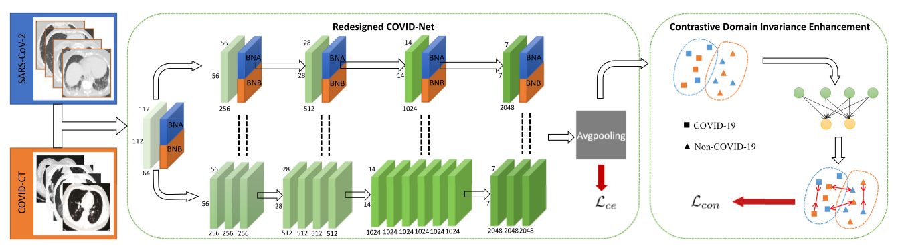

# Contrastive Cross-Site Learning With Redesigned Net for COVID-19 CT Classification
## aim
1. enlarge the datasets and helpful to aggregate the cased from different medical systems for learning robust and generalizable models.  
2. a novel joint learning framework  
3. powerful backbone by redesigning the recently proposed COVID-Net  
4. tackle the cross-site domain shift by conducting seperate feature normalization in latent space  
5. propose to use a contrastive training objective to enhance the domain invariance of semantic embeddings for boosting the classification performance on each dataset  

## method
## background
1. dataset 

2. method  
Add BN layer  
Add lr decay method(cos)  
3. model structure  

## experiment
1. two public large-scale COVID-19 diagnosis datasets made up of CT images
