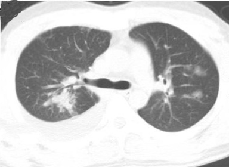

# Contrastive Cross-Site Learning With Redesigned Net for COVID-19 CT Classification
## aim
1. enlarge the datasets and helpful to aggregate the cased from different medical systems for learning robust and generalizable models.  
2. a novel joint learning framework  
3. powerful backbone by redesigning the recently proposed COVID-Net  
4. tackle the cross-site domain shift by conducting seperate feature normalization in latent space  
5. propose to use a contrastive training objective to enhance the domain invariance of semantic embeddings for boosting the classification performance on each dataset  

## method
1. contribution  
Add BN layer  
Add lr decay method(cos)  
Transform from BN to DSBN;Employ domain-specific batch normalization method:assigning an individual BN layer for each site independently  

2. model structure  
  
## background
1. dataset 

2. method  

## dataset
1. COVID-CT  
  
2. SARS-Cov-2  
.png)  
## experiment
1. two public large-scale COVID-19 diagnosis datasets made up of CT images
