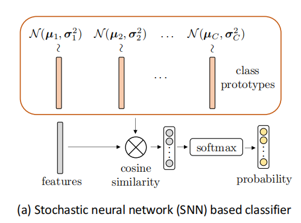
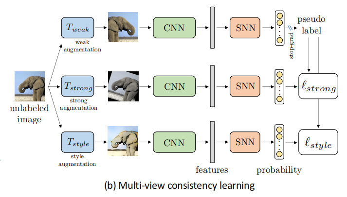

# Style match
### Assumption
X and Y denote the input and the label space respectively, a domain is defined as a joint distribution P(X,Y) over XxY. P(X) and P(Y) denote the marginal distribution of X and Y respectively. Only consider the  distribution shift occuring in P(X) but not in P(Y), that is all domains share the same label space.  
DG settings
using some labeled data and multiple unlabeled data to finish task. Adding third view based on FixMatch  
### techniques

##### SNN
  
##### Softplus

##### Cosine similarities

### Pseudo-labeling
   Introducing three kinds of augmentation of an image:week augmentation(flip and crop),strong augmentation(RandAugment and Cutout),style augmentation(AdaIN) And the idea is that predictions of these augmentations from different views should be same.  

### Stochastic Classfier
   Z denote feature of an image X and C the total number of classes. The prediction of Z is Y=WZ+b. W=[W1,W2,W2...Wn] WZ computes the similarities between the image X and each class prototype $W_{C}$. In the stochastic classifier, each class prototype $W_{i}$ is modeled using a Gaussian distribution by $N(μ_{c},σ_{c}^{2})$.  
   
$W_{c}=μ_{c}+softplus(σ_{c}·\epsilon),\epsion ∈N(0,1)$  

   once all class prototypes are obtained, the similarity scores are computed based on cosine similarity(sim(·,·)). And then passed to the softmax function for generating normalized probabilities.(Softmax with \tau, that is temperature parameter fixed to 0.05)  
   When test:  
$W_{c}=μ_{c}$
### Multi-View Consistency Learning via StyleMatch
##### Two-view consistency
Seen at FixMatch  
##### the third view
Image style is relative to domain, so introducing style augmentation can help cope with domain shift.  

### overall structure
  
##### loss
$loss=l_{supervised}+l_{unsupervised}$  
$l_{supervised}=$  
$l_{unsupervised}=l_{strong}+l_{style}$  
