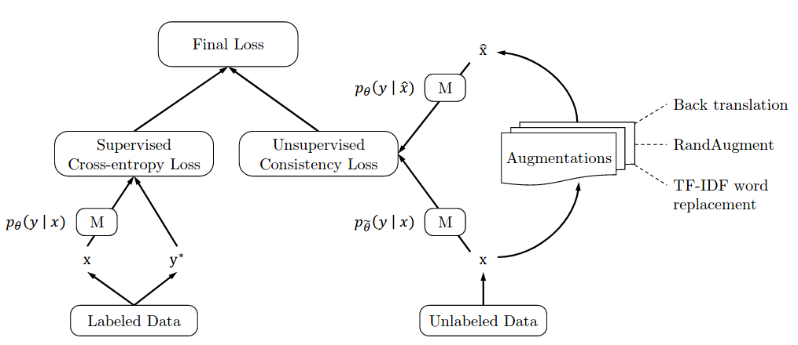

# Unsupervised data augmentation for consistency training
## introduction
1. common approaches is the use of consistency training on a large amount of unlabeled data to constrain model predictions to be invariant to input noise  
2. substituting simple noising operations with advanced data augmentation method such as RandAUG and back-translation, bring substantial improvements  
3. evaluation on text and image

## background
## method
1. TF-IDF  
(1)is designed to retain keywords and replace uninformative words  
(2)When a word is replaced, sample another word from the whole vocabulary for the replacement  
(3)The sampled word and replaced word should not be key word.(based on a score)  
2. Back translation  
(1)translating an existing example x in language A into another language B and then translating it back into A  
(2)In this paper:WMT14English-French/maybe english-russian  
3. RandAugment  
(1)inspired by AutoAugment and only using PIL  
(2)simpler and requires no labeled data as there is no need to search for optimal policies  
  
# dataset
## cifar10
## SVHN
## IMDb
## Yelp...

